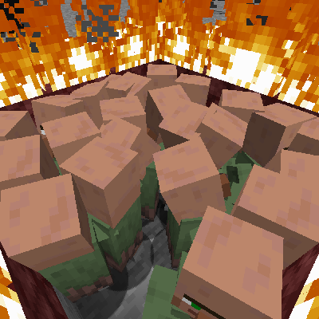

**!!NOTICE!!:** I have decided to abandon Minecraft in favor of the FOSS Minetest ([https://www.minetest.net](https://www.minetest.net "Minetest website")). As such, this project will no longer be maintained or developed.

# Nitwit Only Mode

Ever wanted all the villagers in your world to be nitwits? No? Well, too bad! Now they are.

A datapack for Minecraft 1.19 (but should work for 1.13+) that makes all villagers useless nitwits.

## Installation

Grab a version from [RELEASES](https://github.com/ona-li-toki-e-jan-Epiphany-tawa-mi/Nitwit-Only-Mode "Nitwit Only Mode Releases Page") and place it inside your world's datapacks folder. [See for more information.](https://minecraft.fandom.com/wiki/Tutorials/Installing_a_data_pack "A Minecraft Wiki tutorial on installing data packs")

## Uninstallation

To uninstall, remove the datapack from your world's datapacks folder and reload.

Note: villagers will **NOT** be reverted to their original profession nor will their trades be restored.
